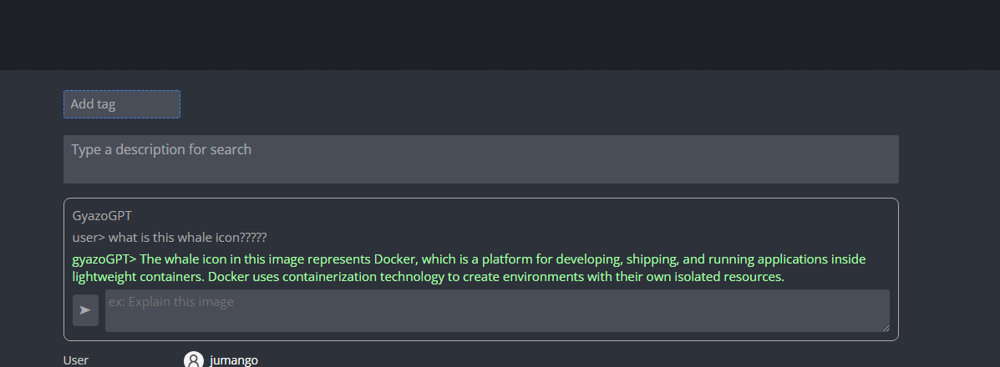

# GyazoGPT

a chrome extension that enhances gyazo with GPT-4 vision capabilities

# installation

1. clone this repo to specific folder

2. load from chrome extension settings

3. from extension ui window, set OpenAIAPIKey.

4. take shot then enjoy!

